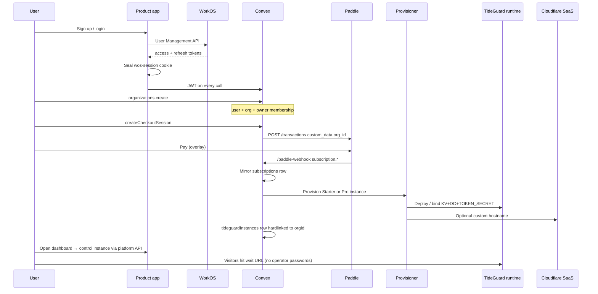

# Hosted TideGuard (SaaS tier)

Planning doc for selling TideGuard as a hosted product on Cloudflare: zero-setup
onboarding, platform-owned identity/billing, and optional dedicated isolation.

Self-hosted OSS stays as today (Deploy to Cloudflare / CLI, local admin claim).
This document is for the **hosted** product only.

Related: [architecture.md](architecture.md), [custom-domain.md](custom-domain.md),
[protecting-origin.md](protecting-origin.md). Patterns below are adapted from the
SourceTrust MonoRepo (`/Users/m/Documents/MonoRepo`), which already runs WorkOS +
Paddle + Convex + Cloudflare for SaaS successfully.

---

## Product intent

1. Customer pays (Paddle) → we provision everything → they get a URL and log in.
2. They do **not** manage `TOKEN_SECRET`, Cloudflare API tokens, Turnstile, or
   instance-local admin passwords.
3. Operator identity and billing live in **our** dashboard (WorkOS + Paddle +
   Convex). The TideGuard runtime is headless and hardlinked to the org.
4. Zero-touch for the **TideGuard side**. Connecting their origin/domain is a
   short guided checklist — do not oversell “do nothing” for origin protection.

---

## What an “instance” is

TideGuard is already a Worker + Durable Object + KV waiting room. An instance is
**not** a container or VM.

| Piece | Role |
| --- | --- |
| Worker | HTTP, tokens, proxy, visitor UI |
| `QueueRoom` DO | Authoritative queue state + alarms |
| `CONFIG_KV` | Config / branding (no operator passwords in hosted mode) |
| Assets | Optional; prefer admin UI on the platform |
| `TOKEN_SECRET` | We mint and inject; customer never sees it |

Spin-up = create bindings + route traffic + hardlink org → runtime.

---

## Isolation tiers (A and B)

Sell **outcomes**, not architecture names.

| Customer-facing tier | Under the hood | What they get |
| --- | --- | --- |
| **Starter / Launch** | Soft multi-tenant (**B**): one shared Worker; `DO idFromName(tenant:…)` + KV key prefixes | Instant `you.tideguard.app`, lower price |
| **Pro / Dedicated** | Workers for Platforms User Worker (**A**): dedicated script + bindings per tenant | Isolation, higher limits, quieter neighbors, vanity domain |

```text
Starter (B)
  acme.tideguard.app ──► shared TideGuard Worker
                              ├─ KV: tenant:acme:…
                              └─ DO: idFromName("acme:default")

Pro (A)
  wait.customer.com / acme.tideguard.app
        │
        ▼
  Cloudflare for SaaS (TLS)
        │
        ▼
  Dispatch Worker ──► User Worker (TideGuard copy)
                         ├─ own CONFIG_KV
                         ├─ QueueRoom DOs
                         └─ TOKEN_SECRET
```

### Tier rules (agreed)

- Map tiers to **limits + domain + isolation**, not “shared vs WfP.”
- Do not run A and B forever without a **one-way Starter → Pro upgrade**.
- B is enough for many customers (DOs already isolate queues). Use A when the
  customer pays for isolation / limits, or when B starts hurting ops.
- Prefer naming like “Launch” / “Dedicated”, never “Model A/B” in UI.

### Cloudflare products by layer

| Layer | Product | Why |
| --- | --- | --- |
| Multi-tenant compute (Pro) | [Workers for Platforms](https://developers.cloudflare.com/cloudflare-for-platforms/workers-for-platforms/) | Dispatch namespace + User Workers |
| Soft tenancy (Starter) | Single Worker + DO names | Cheap, instant |
| Routing / TLS | [Cloudflare for SaaS](https://developers.cloudflare.com/cloudflare-for-platforms/cloudflare-for-saas/) | Custom hostnames → Worker-as-origin |
| Queue state | Durable Objects | Same as OSS |
| Config | KV (per-tenant or prefixed) | Same as OSS |
| Secrets | Secrets Store / WfP secrets API | Per-tenant `TOKEN_SECRET` |
| Provisioning | Workflows (or Convex actions) | Create KV → deploy → secret → hostname → Turnstile |
| Control plane data | Convex (as in MonoRepo) | Orgs, memberships, subscriptions, domains |
| Metering | Workers Analytics Engine + GraphQL | Per-tenant usage for support / future usage bills |
| Limits (Pro) | WfP custom limits | Cap CPU / subrequests by plan |

**Not used:** Containers, VMs, Redis, external queue brokers, per-customer
Cloudflare accounts (except white-glove edge cases).

---

## Three planes

### 1. Runtime plane (TideGuard Worker)

- OSS Worker remains the **tenant runtime image**.
- Hosted build flag: `HOSTED=1` (or equivalent):
  - No admin claim / password store / local invites
  - No “paste your Cloudflare API token” setup
  - Admin mutations only via platform-signed credentials
- Visitor admission (`TOKEN_SECRET`, tickets) stays on the instance — customers
  never manage those secrets.

### 2. Control plane (new app — clone SourceTrust shape)

| Concern | Owner |
| --- | --- |
| Login, org, roles, invites | WorkOS (identity) + Convex (tenancy/RBAC) |
| Payment, plan, suspend | Paddle + Convex subscription mirror |
| Tenant ↔ runtime hardlink | Convex `orgId` → instance id / script name / hostname |
| Provision / upgrade / teardown | Workflow or Convex actions |

### 3. Edge routing plane

- Starter: `*.tideguard.app` → shared Worker (tenant from Host).
- Pro / vanity: Cloudflare for SaaS custom hostname → dispatch or shared Worker.
- Auth cookies **only** on the product app host (see host split below).

---

## Identity and billing: hardlink model

```text
WorkOS (identity only)
        │
        ▼
Convex control plane  ←── Paddle webhooks (money source of truth)
  users / orgs / memberships / subscriptions / domains
        │  platform session + service credentials
        ▼
TideGuard instance (headless runtime)
  queue + branding + visitor tokens
```

### What lives where

| Concern | Platform | Instance |
| --- | --- | --- |
| Login, org, roles, invites | WorkOS + Convex | No |
| Payment, plan, suspend | Paddle + Convex | Entitlement check only if needed |
| Visitor HMAC `TOKEN_SECRET` | We mint & inject | Holds binding; no UI |
| Queue / branding / admit rate | Edit in platform UI | Stores operational config |
| Admin passwords / TideGuard invites | — | **Off** in hosted mode |

### Hardlink chain (copy from SourceTrust)

```text
WorkOS subject → users.authSubject
              → memberships(orgId, userId, role)
              → users.activeOrgId
              → subscriptions.orgId  (+ Paddle custom_data.org_id)
              → customDomainHostnames.orgId
              → tideguardInstances.orgId  (NEW: script/slug/bindings)
```

### Agreed design pressure

1. **Hard-disable local admin** in hosted builds — no second auth truth.
2. **Admin UI on the platform**; instance is an API the platform calls
   (mTLS / service token / platform-signed JWT). Do not bolt WorkOS onto each
   instance `/admin`.
3. **Instance must not hold WorkOS secrets** — trust platform assertions or JWKS
   only if the instance must validate JWTs itself.
4. **Team access = Convex membership / invites**, not TideGuard invite tables.
5. **Break-glass** via platform service account if WorkOS is down — not a
   password printed into the instance.
6. **Paddle webhooks drive provision / freeze / teardown** — not “user clicked
   Activate.”

---

## Onboarding: “pay → URL”

### Zero-touch (TideGuard side)

1. Sign up / log in on `app.tideguard.dev` (WorkOS).
2. Create org (lazy user row + owner membership).
3. Accept billing terms → Paddle checkout (`custom_data.org_id`).
4. Webhook mirrors subscription → entitlement active.
5. Provisioner creates Starter (B) or Pro (A) runtime, injects `TOKEN_SECRET`,
   attaches hostname `acme.tideguard.app`, provisions Turnstile under **our**
   Cloudflare account.
6. Hand the user the **platform** dashboard deep-link for that waiting room
   (not an instance-local magic session).

### Still required (customer side — keep short)

Do not pretend origin protection is zero-setup:

- Optional vanity: CNAME + DCV for Cloudflare for SaaS.
- Point traffic at TideGuard (redirect, route, or proxy).
- Lock down origin so visitors cannot bypass the queue.

Product copy: **“Waiting room ready instantly”** + **“Connect your domain /
origin in a few steps.”**

---

## Replicate SourceTrust (MonoRepo) patterns

Source of truth for a working stack: `/Users/m/Documents/MonoRepo`.
WorkOS is **identity-only**. Orgs, roles, billing, and domains live in **Convex**.
Paddle is the **money source of truth**; Convex mirrors it. Custom domains use
**Cloudflare for SaaS**.

### 1. WorkOS — identity only

Key files:

| Role | Path |
| --- | --- |
| Headless auth (password, magic, OAuth, reset, step-up) | `MonoRepo/apps/app/src/lib/auth.ts` |
| OAuth callback | `MonoRepo/apps/app/src/routes/api/auth/callback.tsx` |
| Middleware (`authkitMiddleware`, CSRF, refresh) | `MonoRepo/apps/app/src/start.ts` |
| Route gate | `MonoRepo/apps/app/src/routes/_authenticated.tsx` |
| Convex JWT → WorkOS JWKS | `MonoRepo/packages/backend/convex/auth.config.ts` |
| Viewer / `orgQuery` / `orgMutation` | `MonoRepo/packages/backend/convex/lib/auth.ts` |
| Architecture doc | `MonoRepo/docs/architecture/05-authentication.md` |

Patterns to copy:

- Custom login/signup UI on the **product host only** (not Hosted AuthKit UI).
- Seal `{accessToken, refreshToken, user}` into `wos-session` cookie; middleware
  refreshes every request.
- Client bridges WorkOS access token into Convex (`ConvexProviderWithAuth`).
- Convex validates JWT via JWKS; `getViewer` maps `identity.subject` → `users`.
- **Do not use WorkOS Organizations / WorkOS RBAC** — tenancy is Convex.
- Lazy user provisioning: no `users` row until org create or invite accept.
- Invites: Convex `invitations` row; accept requires signed-in JWT email match.
- Roles in Convex: e.g. `owner | admin | editor | viewer` (+ optional `finance`).
- Staff = env email allowlist, not a customer role.
- No WorkOS webhooks required; account delete calls WorkOS REST to remove user.
- MFA / step-up for destructive actions (optional but proven).

### 2. Paddle — entitlement source of truth

Key files:

| Role | Path |
| --- | --- |
| Checkout / cancel / interval | `MonoRepo/packages/backend/convex/lib/billing/checkoutActions.ts` |
| Webhook apply + subscription mirror | `MonoRepo/packages/backend/convex/lib/billing/webhooks.ts` |
| Entitlement gates | `MonoRepo/packages/backend/convex/lib/billing.ts` |
| Pure entitlement rules | `MonoRepo/packages/shared/src/billing/entitlements.ts` |
| HTTP ingress | `MonoRepo/packages/backend/convex/http.ts` (`POST /paddle-webhook`) |
| Signature verify | `MonoRepo/packages/backend/convex/lib/paddleWebhook.ts` |
| Price/env config | `MonoRepo/packages/backend/convex/lib/paddleConfig.ts` |
| Docs | `MonoRepo/docs/architecture/07-billing.md` |

Patterns to copy:

- Checkout creates a Paddle transaction with **`custom_data: { org_id }`** —
  this is the billing hardlink.
- Webhooks upsert one `subscriptions` row per org; never trust the client for
  paid state.
- Dual entitlement:
  - **Grace** for existing paid outputs while `cancelled` until period end /
    `past_due`.
  - **Strict** for new capacity (only `active` can activate new resources).
- Webhook event id dedupe (`processedWebhookEvents`) + status lattices (do not
  downgrade paid → failed out of order).
- Charge-consent: pin `expectedChargeMinor` before mutating money side effects.
- Comp / 100% codes can skip Paddle with synthetic subscription ids if needed.
- Duplicate live subscription → alert + cancel the duplicate.
- Drift alerts when Paddle qty and local counts disagree (retry cron).

TideGuard mapping (rename carefully):

| SourceTrust unit | TideGuard candidate |
| --- | --- |
| Active projects qty | Waiting rooms / instances |
| Custom domain add-on qty | Vanity hostnames |
| Branch / security add-ons | Higher admit rate, dedicated (A), analytics retention, etc. |

### 3. Convex — tenancy + mirror

Core tables to replicate (names can match):

| Table | Purpose |
| --- | --- |
| `users` | `authSubject`, `email`, `activeOrgId` |
| `organizations` | `slug`, suspended, billing terms, teardown |
| `memberships` | `orgId`, `userId`, `role` |
| `invitations` | email, role, token, TTL |
| `subscriptions` | Paddle mirror (`status`, period, quantities) |
| `payments` | Transaction mirror |
| `processedWebhookEvents` | Idempotency |
| `billingAlerts` | Drift / unbound subscription |
| `customDomainHostnames` | Hostname lifecycle |
| **`tideguardInstances`** (new) | `orgId`, tier (`shared`\|`dedicated`), slug, script name, hostname, status |

Isolation pattern (copy this):

```text
WorkOS JWT → getViewer → orgQuery/orgMutation inject {user, membership, org, role}
→ every query scoped by ctx.org._id + requireRole(can())
```

Never trust a client-supplied `orgId`. No Convex RLS wrappers — application
enforced tenancy.

### 4. Custom domains — Cloudflare for SaaS

Key files:

| Role | Path |
| --- | --- |
| Domain CRUD + poll + Paddle sync | `MonoRepo/packages/backend/convex/customDomains.ts` |
| CF API | `MonoRepo/packages/backend/convex/lib/cloudflareCustomHostnames.ts` |
| Host boundary | `MonoRepo/apps/app/src/lib/host-boundary.ts` |
| Multi-tenancy doc | `MonoRepo/docs/architecture/06-multi-tenancy.md` |

Status machine:

```text
pending_dns → verified | failed
(+ routingVerified; dnsRecords for ownership | certificate | routing)
```

Onboarding flow to copy:

1. Require active/past_due subscription + `manage_billing`.
2. Optional charge preview + pinned expected charge.
3. Create Cloudflare custom hostname **first**.
4. Insert DB row; rollback CF delete if insert fails.
5. Best-effort sync domain qty to Paddle; `domainsSyncPending` on failure.
6. Show DNS instructions (CNAME target + DCV).
7. Poll until `verified` **and** `routingVerified`.
8. Serve waiting room / platform public surface only when both are true.

Pending older than ~14 days → `failed`; re-poll failed rows periodically.

### 5. Host split (critical UX/security)

Copy SourceTrust’s three-host idea:

| Host | Job |
| --- | --- |
| Marketing apex (e.g. `tideguard.dev`) | Sales site (may already be TideGuard-Website) |
| Product app (e.g. `app.tideguard.dev`) | WorkOS login, org, billing, instance controls |
| Runtime / wait hosts (e.g. `*.tideguard.app` or customer vanity) | Visitor waiting room + token issuance |

Rules:

- Auth cookies / `getAuth()` **only** on product session hosts.
- Custom / wait hosts are **sessionless** for operators.
- Org context for authenticated routes comes from membership + org switcher,
  **never** from a path segment on the app host.

### 6. End-to-end sequence



### 7. Edge-case cheat sheet (from SourceTrust)

| Scenario | Behavior to replicate |
| --- | --- |
| Cancel | Access / existing room until `billingPeriodEnd`; block new rooms immediately |
| Past due | Keep existing waiting room operable; block new activations; warn in UI |
| Paused / expired | Block paid operator actions; product choice on whether visitors still admit |
| Domain DNS fail | `failed` + `lastError`; re-poll; do not orphan CF hostnames |
| CF create OK, DB insert fail | Delete CF hostname |
| Paddle domain sync fail | Domain can still verify; retry qty sync |
| Invite wrong account | Email mismatch error |
| Duplicate Paddle sub | Alert + cancel duplicate |
| Org deleting | Snapshot external ids (Paddle, CF, Worker script); retry teardown cron |
| Auth on wait/custom host | Forbidden — redirect to product app |

### 8. Env / secrets checklist

**Product app**

- `WORKOS_CLIENT_ID`, `WORKOS_API_KEY`, `WORKOS_COOKIE_PASSWORD` (≥32), `WORKOS_REDIRECT_URI`
- `VITE_CONVEX_URL`, product hostname vars
- `VITE_PADDLE_CLIENT_TOKEN`, `VITE_PADDLE_ENVIRONMENT`
- `CONVEX_INTERNAL_KEY` (platform ↔ Convex sealed actions)

**Convex**

- `WORKOS_CLIENT_ID` (JWT aud / JWKS)
- `PADDLE_API_KEY`, `PADDLE_WEBHOOK_SECRET`, `PADDLE_ENVIRONMENT`, `PADDLE_PRICE_ID_*`
- `BILLING_ENFORCEMENT`, `BILLING_DEV_BYPASS`
- `CLOUDFLARE_CUSTOM_DOMAIN_API_TOKEN`, zone id, CNAME target, DCV delegation, fallback origin
- `STAFF_EMAILS`, email provider keys as needed
- Cloudflare account credentials for **provisioning** TideGuard runtimes (API token with Workers / WfP / KV / DO / secrets)

Webhook URL shape: `https://<deployment>.convex.site/paddle-webhook`

Templates to steal from: `MonoRepo/.env.example`, `MonoRepo/apps/app/.dev.vars.example`.

---

## Hosted vs OSS matrix

| Capability | OSS self-host | Hosted |
| --- | --- | --- |
| Deploy | Customer Cloudflare account | Our account (B or A) |
| Admin auth | Local claim / passwords / invites | WorkOS + Convex membership |
| Cloudflare API token in setup | Customer pastes | We own zone / Turnstile |
| `TOKEN_SECRET` | Customer sets | We mint |
| Custom domain | Their zone / docs | Cloudflare for SaaS + guided DNS |
| Billing | — | Paddle |
| Upgrades | Customer redeploys | We fan-out User Workers / shared Worker |

---

## Phased delivery (recommended)

1. **Control plane MVP** — WorkOS + Convex orgs/memberships + Paddle checkout/webhooks (no runtime yet).
2. **Starter runtime (B)** — shared Worker, `*.tideguard.app`, platform→instance API, `HOSTED=1`.
3. **Connect origin checklist** — docs + in-app steps (CNAME, proxy, origin lock).
4. **Custom domains** — Cloudflare for SaaS + Paddle add-on qty (copy SourceTrust).
5. **Pro runtime (A)** — WfP User Workers + upgrade path from Starter.
6. **Hardening** — teardown retries, billing drift alerts, break-glass, Analytics Engine metering.

---

## Open product choices (decide before build)

1. On cancel / expire: do visitors still get admitted until period end, or freeze admit?
2. Free tier: draft/config-only room vs paid-only?
3. Entitlement unit: per waiting room, per admit volume, or flat seat?
4. Where does branding edit live first — platform only, or read-only mirror on instance?
5. Single Convex deployment for control plane vs separate TideGuard-hosted backend package?

Default lean: **grace for visitors until period end**, **strict for new rooms**,
**per waiting room qty**, **platform-only admin UI**, **one Convex backend**.

---

## Bottom line

- **Under TideGuard:** Workers, Durable Objects, KV (already).
- **Around it:** WorkOS (login) + Convex (tenant/RBAC/mirror) + Paddle (`custom_data.org_id`) + Cloudflare for SaaS (vanity) + provisioner for Starter (B) / Pro (A).
- **Hardlink:** `WorkOS subject → user → membership → org → subscription/domain/instance`.
- **Do not** put operator passwords on the instance; **do** keep a short
  connect-origin checklist; **do** copy SourceTrust’s host split and webhook
  entitlement discipline.
